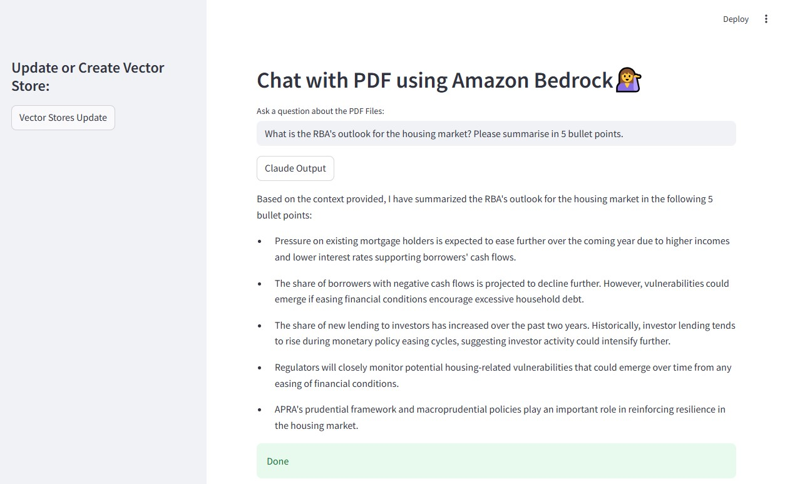
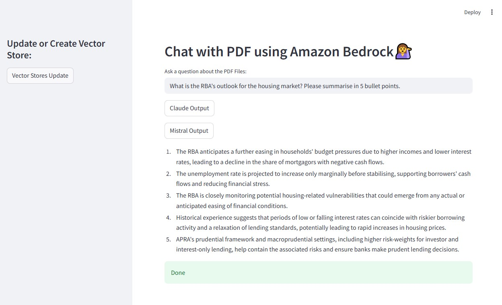

### Use Case for this Project
- A Q&A chatbot based on documents allows users to get answers to their questions related to the documents.

### AWS Services
- Amazon Bedrock
  - Fully managed service, offering high-performing foundation models (FMs) including Anthropic. 
- Amazon Titan Text Embeddings
  - A text embeddings model that converts natural language text—consisting of single words, phrases, or even large documents—into numerical representations that can be used to power use cases such as search, personalization, and clustering based on semantic similarity.
    
### How does it work?
- Step 1: Ingest Data
  - PDF documents are ingested.
- Step 2: Prepare documents
  - PDF documents are split into chunks.
  - Embeddings are created with Amazon Titan.
  - FAISS meta database -> Vector store is created.
  - PDF documents are stored as Vector Store.
- Step 3: Ask Questions
  - When we ask a question,
  - 1) It will do similarity search from the vector store.
    2) Relevant chunks of the documents are given to LLM model along with the prompt.
    3) LLM model will provide an answer.
- Langchain along with LLM Model from Amazon Bedrock

### Document Q & A Application - Use Case
1. Update required_libraries.txt to have the following:
  - `boto3`
  - `awscli`
  - `pypdf`
  - `langchain`
  - `langchain_community`
  - `streamlit`
  - `faiss-cpu`
  - `cryptography>=3.1`
2. Install required libraries
  - Run `pip install -r required_libraries.txt`
3. Create a `data` folder and place a PDF file to be used for the app
  - `RBA_financial-stability-review-2025-04.pdf`
4. Build a Python Script
  - Create a new file called `app.py`
  - Build a Python Script here
5. Open the app as a new tab
  - Run the command in cmd: `streamlit run app.py`
6. Click on the button `Vector Stores Update`
  - This will ingest the PDF files, convert those into vector stores, and store them under faiss_index.
  - This process may take a few minutes depending on the size of the PDF files.
7. Once Vector Stores have been updated, you will see `Done - Vector Store Updated!`
8. Enter a question and click on either `Claude Output` or `Mistral Output`
  - Simple Questions for RBA Financial Stability Review
    - "What are the key risks to Australia's financial system?"
    - "How has household debt changed recently?"
    - "What is the RBA's outlook for the housing market?"
    - "What trends are observed in commercial property lending?"
    - "How are banks performing in terms of capital and liquidity?"
    - "What is the RBA's view on global economic risks?"
    - "What measures has the RBA suggested to strengthen financial stability?"
    - "How vulnerable are households to rising interest rates?"
    - "What is the trend in business loan arrears?"
    - "What stress tests has the RBA conducted on banks?"
9. Check the response
  - Question: What is the RBA's outlook for the housing market? Summarise it with 5 bullet points.
  - Answer - Claude Output:
  -  
  - Answer - Mistral Output:
  - 

### Official Resources
- Invoke Model API Documentation:​ [Amazon Bedrock User Guide](https://docs.aws.amazon.com/bedrock/latest/userguide/bedrock-runtime_example_bedrock-runtime_InvokeModel_MetaLlama3_section.html)
- Meta Llama Models Overview: [Amazon Bedrock User Guide](https://docs.aws.amazon.com/bedrock/latest/userguide/model-parameters-meta.html)
- Inference Profile ID: [Amazon Bedrock User Guide](https://docs.aws.amazon.com/bedrock/latest/userguide/inference-profiles-support.html)
- Supported Foundation Models in Amazon Bedrock: [Amazon Bedrock User Guide](https://docs.aws.amazon.com/bedrock/latest/userguide/models-supported.html)
- Invoke Amazon Titan Text models on Amazon Bedrock using the Invoke Model API [Amazon Bedrock User Guide](https://docs.aws.amazon.com/bedrock/latest/userguide/bedrock-runtime_example_bedrock-runtime_InvokeModel_TitanText_section.html)
  
### Tips
- Set up budget associated with AWS account
  - AWS has  "Zero spend budget" template - which notifies you once your spending exceeds $0.01 which is above the AWS Free Tier limits.

### Prerequisites
- Conda
  -  Can be installed via Miniconda installer which is a lightweight version of the Anaconda Distribution installer that only provides conda, its dependencies, and a few other select packages.
  -  Added naconda3 to my PATH environment variable
- Visual Studio Code (GitHub Copilot integrated)
- AWS account (Root user)

### Set up
**Visual Studio Code**
1. Create a virtual environment
  - View > New Terminal > Switch to Command Prompt
    - Navigate to the folder where a virtual environment will be created
    - Run `conda create -p venv python==3.10`
      - Explanation: `-p venv`: to create the environment in the venv directory; relative to my current working directory
2. Activate this environment
  - Run `conda activate venv/`
3. Create a Requirements text file with required libraries
  - File > New Text File
    - enter `boto3` and
      - This is AWS SDK for Python. This is used to interact with AWS services programmatically.
    - enter `awscli` in the next line
      - This is AWS Command Line Interface. This is used to manage AWS servies from the command line.
  - Save as `required_libraries.txt`
4. Install required libraries
  - Run `pip install -r required_libraries.txt`
    - Explanation: `-r` is `--requirement`. It specifies that the argument following this is a requirements file containing a list of dependencies to install.

**AWS**
1. Create a IAM user
  - AWS Console > Search `IAM`
  - Go to `Users` in the Access management section
  - Click on `Create user`
    - Step 1: Set user name: `testadmin`
    - Step 2: Set permission options: tick `Attach policies directly`
      - Select the policy `AdministratorAccess` (Type: AWS managed - job function)
    - Step 3: Review and create user
2. Create access key
  - IAM > Users > testadmin
  - Click `Create accesss key`
    - Step 1: Select the use case as  `Command Line Interface (CLI)`: to use this access key to enable the AWS CLI to access your AWS account.
    - Step 2: Set description tag as `testkey`. Then, click on `Create access key`
    - Step 3: Retrieve access keys  - For later use, download both `access key` and `secret access key` as .csv file.
    - Copy this access key to configure in VS
3. Set Model Access for Amazon Bedrock
  - AWS Console > Search `Amazon Bedrock`
  - Go to `Model access` in the Bedrock configurations section. By default, access is not granted to any of the base models.
    - Note that the availability of models varies across regions.
  - Click on `Enable specific models` 
    - Request the following models: **Meta's Llama 3.2 3B Instruct**, **Anthropic's Claude**, **Amazon's Titan Embeddings G1 - Text**
    - Note that:
      - generally, models with fewer parameters are more cost-effective.
      - Meta's Llama 3.3 70B Instruct is equivalent to Open AI's GPT-4o.
      - Anthropic's Claude will require use case details.
        - Note that the Anthropic API can be for individual use as specified in the[ Anthropic's official website](https://support.anthropic.com/en/articles/8987200-can-i-use-the-anthropic-api-for-individual-use)
        - Once you submit the access request, Amazon or Anthropic may need to review your use case, company information, and other details you provided. This could take anywhere from a few hours to several days. In my case, access was granted within a few minutes and when I requested access for Claude only, both Claude and Claude 2.1 were changed to In Progress, and then 
Access granted.

**Visual Studio Code**
1. In the Command Prompt, run `aws configure`
  - It will display `File association not found for extension .py` and ask for:
  - AWS Access Key ID: enter the copied access key
  - AWS Secret Access Key: copy it from AWS and paste it here
  - Default region name: enter `us-east-1`
  - Default outputformat: enter `json`

### Build
**Meta's Llama Model - PoC**
1. Build a Python Script for Llama 3.2 3B Instruct API Request
  - Create a new file called `llama3.py`
  - Build a Python Script here
    - `region_name="us-east-1"`
    - `model_id = "us.meta.llama3-2-3b-instruct-v1:0"`
  - Run the command in cmd: `python llama3.py`
2. Check the response
  - prompt: "Analyze this customer feedback: 'I’ve been waiting too long for my loan approval, and the staff was not helpful.' And summarize the top 3 areas of improvement based on these customer feedback responses.
  - response:
    > Based on the customer feedback, the top 3 areas of improvement are:
    > 1. **Loan Processing Time**: The customer feels that they have been waiting too long for loan approval. This suggests that the loan processing time is too slow, and the customer is experiencing frustration and delay in receiving their loan.
    > 2. **Customer Service**: The customer mentions that the staff was not helpful, implying that the customer service provided by the staff was inadequate or unresponsive. This could be due to a lack of communication, unavailability of staff, or a general lack of empathy from the staff.
    > 3. **Overall Experience**: The customer's overall experience with the company seems to be negatively impacted by the slow loan processing time and poor customer service. This suggests that the customer's expectations were not met, and they are unlikely to recommend the company to others.
    > These three areas of improvement are interconnected, as a faster loan processing time can help improve customer satisfaction and reduce frustration, while better customer service can lead to a more positive overall experience.

**Anthropic's Claude Model - PoC**
1. Build a Python Script for Claude 2.1 Model API Request
  - Create a new file called `claude.py`
  - Build a Python Script here
    - `region_name="us-east-1"`
    - `model_id = "anthropic.claude-v2:1"`
  - Run the command in cmd: `python claude.py`
2. Check the response
  - prompt: "Analyze this customer feedback: 'I’ve been waiting too long for my loan approval, and the staff was not helpful.' And summarize the top 3 areas of improvement based on these customer feedback responses.
  - response:
    > Here is an analysis of the key points in the customer feedback:
    > 1. The customer has been waiting too long for a loan approval. This indicates there may be issues with the efficiency or speed of the loan approval process.
    > 2. The staff was unhelpful. This suggests problems with customer service and staff helpfulness.
    
    > Based on this, the top 3 areas of improvement would be:
    > 1. Improve efficiency of loan approval process to reduce customer wait times
    > 2. Train staff to be more helpful and customer-focused when assisting customers
    > 3. Review customer service protocols to ensure staff are providing an adequate level of support during the loan process

    > The key areas highlighted in the feedback are wait times/process efficiency, staff helpfulness, and customer service. Addressing these areas by improving processes, enhancing staff training, and refining customer service protocols could help resolve the issues surfaced in this complaint. Let me know if you need any clarification or have additional questions!
